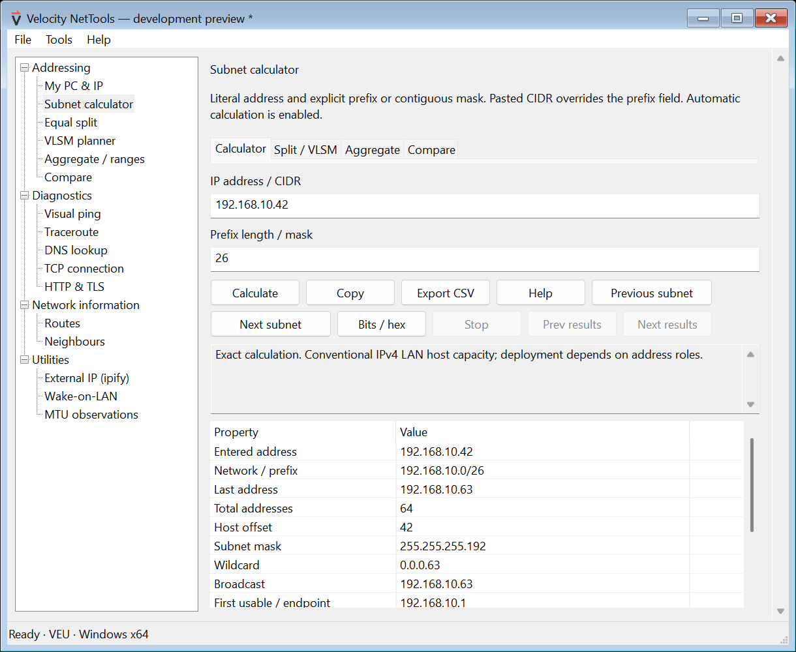

<div align="center">


# Velocity NetTools

**Clarity for every connection.**

A portable native Windows toolkit, an installable web subnet planner and an engineer’s field guide.

**By [Velocity EU Inc](https://www.velocity-eu.com/)**

[Open web app](https://velocityeu.github.io/NetTools/app/) · [Download previews](https://github.com/velocityeu/NetTools/releases) · [Learning centre](https://velocityeu.github.io/NetTools/) · [Help](docs/help/README.md) · [Report an issue](https://github.com/velocityeu/NetTools/issues)

</div>

> **Development preview.** The native application is implemented and undergoing validation. Previews are explicitly unsigned. No stable release is available; read the [validation status and limitations](docs/preview-status.md).



*Actual native Windows development build, using the official corporate icon.*

## Installable web app

[Open Velocity NetTools PWA](https://velocityeu.github.io/NetTools/app/) for IPv4/IPv6 calculation, equal splits, VLSM with pins/reservations, and optional ipify public-IP checks. Phone, tablet and desktop layouts share the native application's C++ arithmetic core compiled to WebAssembly.

Add to Home Screen on iOS/iPadOS 17+; use Install app in supporting Android/desktop browsers. The first load requires internet. After Offline ready appears, calculations, planning and bundled help work offline. Plans are saved explicitly on this device; export PWA JSON backups for safekeeping. These backups are not Windows plan files.

Updates are checked automatically on launch, foreground return and every 15 minutes while visible. All open app tabs must be idle with no unsaved changes before activation; otherwise an update prompt lets you continue working. No public-IP requests run until a manual check or explicit launch opt-in.

[Install and get started](https://velocityeu.github.io/NetTools/help/web-app-getting-started/) · [Worked examples and backups](https://velocityeu.github.io/NetTools/help/web-app-calculations-and-plans/) · [Offline, updates and public IP](https://velocityeu.github.io/NetTools/help/web-app-offline-updates-and-privacy/)

For ping, traceroute, DNS lookup and local adapter inventory, use the Windows toolkit; these diagnostics are not included in the PWA.

## One executable, practical tools

| Area | Included |
| --- | --- |
| Subnet calculator | Strict IPv4/IPv6 input, exact counts, masks, ranges, binary/hex details and embedded IANA classification |
| Planning | Indexed equal splits, VLSM requirements, pins/reservations, stable ordering, Apply/Undo/Redo |
| Address sets | Exact aggregation, covering supernets with added coverage, range conversion and directional comparison |
| My PC & IP | Local addresses/interfaces; explicit separate ipify IPv4/IPv6 checks |
| Diagnostics | Multi-target visual ping, continuous/pause/rolling views, repeated traceroute, DNS and TCP |
| Network information | Read-only adapter, route and neighbour snapshots |
| Utilities | HTTP/TLS inspection, Wake-on-LAN and bounded MTU observations |
| Help and files | Searchable embedded manual, F1, examples, About, JSON plans and CSV reports |

One portable x64 executable, with a statically linked C++ runtime and Windows-supplied APIs. No installer, driver, browser runtime or separately installed application runtime. Settings/history are session-only unless explicitly saved. Opening a plan never starts probes.

**Compatibility target:** Windows 10 x64 build 10240 onward, Windows 11, and Windows Server 2016 onward with Desktop Experience. The oldest Windows/Server images still require clean-machine validation. Server Core is outside this GUI release.

## Download and run

Choose **ZIP** or **EXE** on the [download page](https://velocityeu.github.io/NetTools/#download).
For ZIP, choose **Extract all** in Windows, then run VelocityNetTools-x64.exe.
The archive contains the identical standalone EXE, a getting-started guide, licence,
third-party notices and checksums for the extracted files. No installation is needed.
Press **F1** for the embedded help.

Each release provides separate ZIP and EXE hashes in SHA256SUMS.txt and the release
manifest. The checksum file inside the ZIP covers its contents; the checksum beside
the download covers the ZIP itself. Previews remain unsigned until corporate signing
is provisioned; archive packaging does not change Windows SmartScreen checks.

## Learn the method

The [field guide](docs/help/README.md) and [learning centre](https://velocityeu.github.io/NetTools/) share worked lessons: subnetting by hand, binary arithmetic, masks, VLSM, IPv6, address sets and diagnostic interpretation.

For **192.168.10.42/26**:

1. IPv4 has 32 bits; **32 − 26 = 6 host bits**.
2. Six bits give **2⁶ = 64 addresses**.
3. Last-octet blocks are 0–63, 64–127, 128–191 and 192–255. **42 is in 0–63**.
4. Network: **192.168.10.0**; broadcast: **192.168.10.63**.
5. Conventional hosts: **192.168.10.1–192.168.10.62**, giving **62 usable hosts**.

The conventional “subtract two” rule changes for /31, /32 and IPv6. See the [worked lessons](docs/help/lessons.md).

## Build and validate

Install Visual Studio 2022 Build Tools with **Desktop development with C++**, the Windows SDK, CMake and Python 3. These are development tools; users only need the executable.

~~~powershell
./scripts/build.ps1 -Configuration Release
~~~

Output: out/native/Release/VelocityNetTools.exe.

Checks cover exact maths and classification, saved-file recovery, native networking, embedded resources, native panes, the complete frame and local loopback fixtures. The [release workflow](.github/workflows/native.yml) additionally verifies imports, manifest/version identity, checksums and provenance.

## Releases and website

Main-branch changes automatically build tested, versioned previews. Publication uses the velocityeu-owned **VEU-NetTools** GitHub App. Public author/committer identity is **VEU**. The private key is never tracked.

Releases are immutable. SHA-256, a release manifest and build provenance accompany each executable. GitHub Pages refreshes the website and verifies the download bytes before displaying versioned links. Stable publication requires signing and a clean-machine compatibility check on the exact source commit.

The native Windows app does not silently update itself. A new release becomes available on [GitHub Releases](https://github.com/velocityeu/NetTools/releases).

To preview the educational website locally:

~~~text
python -m http.server 8765 --bind 127.0.0.1 --directory website-preview/dist
~~~

## Documentation

[Product design](docs/design/product-design.md) · [Maths contract](docs/design/math-contract.md) · [Windows APIs](docs/design/windows-api-contract.md) · [Release pipeline](docs/design/release-pipeline.md) · [Publishing identity](docs/design/publishing-identity.md)

### Web build and verification

Install and activate Emscripten **4.0.15**, Python with **Pillow 12.3.0**, and Node.js. The SDK is a build dependency only.

```sh
python scripts/build_pwa.py
python scripts/package_pwa.py
node --test tests/pwa/*.test.mjs
python tests/pwa/offline_packaging_tests.py
npm install --prefix out/pwa-test --save-exact playwright@1.63.0
node out/pwa-test/node_modules/playwright/cli.js install chromium webkit
node tests/pwa/run-browser.cjs
```

Pages CI rebuilds the engine and offline cache, runs module and real-browser tests, and publishes the whole app alongside the learning centre. Native Windows compilation remains separate. Chromium/WebKit automation does not replace physical iPhone/iPad Home Screen testing; the web app is a preview while that device coverage is completed.

MIT licensed. [Velocity EU Inc](https://www.velocity-eu.com/).
