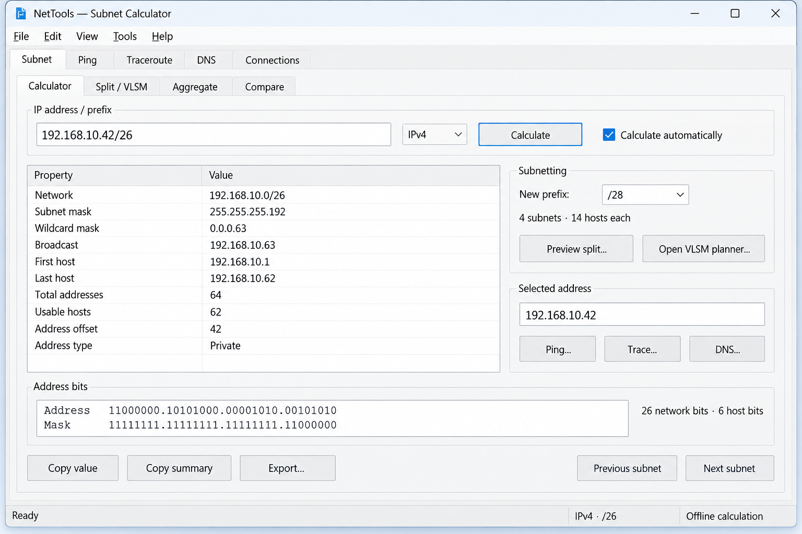

<div align="center">

# Velocity NetTools

**Clarity for every connection.**

A portable native Windows network toolkit, with an engineer’s field guide that explains the numbers behind the answers.

**By [Velocity EU Inc](https://www.velocity-eu.com/)**

[Learn subnetting](docs/help/README.md) · [Design & roadmap](docs/design/product-design.md) · [Releases](https://github.com/velocityeu/NetTools/releases) · [Report an issue](https://github.com/velocityeu/NetTools/issues)

</div>

> **Design phase.** This repository currently contains product designs, learning material and a working webpage preview. The Windows application has not been implemented and no executable is available yet.

## Understand it. Then use it.

Velocity NetTools is being designed for engineers who need accurate answers without installing a large tool suite. The first application release will focus on subnet calculation and planning. The companion learning centre teaches the same operations by hand, with worked examples and practical guidance.



*Interface concept. The final title and About window will use the approved Velocity NetTools branding.*

## The application we are designing

| Area | Proposed scope |
| --- | --- |
| Subnet calculator | IPv4/IPv6, masks, bounds, exact address counts, binary details and address classification |
| Subnet planning | Equal splits, VLSM requirements, pinned allocations and free space |
| Aggregation and comparison | Exact unions, covering supernets, range-to-CIDR, overlap and containment |
| Help | Embedded, searchable manual; F1 context help; examples; glossary; online references |
| Diagnostics, later | Visual ping, traceroute, DNS lookup, adapters, routes and TCP connectivity |

**Target:** Windows 10/11 x64 and compatible Windows Server editions. The precise minimum OS builds and Server Core support are still being defined.

**Distribution:** one portable executable, with no separately installed application runtime. C++20, Win32 controls, MSVC and a statically linked C++ runtime. Windows-supplied APIs provide controls, networking and graph rendering.

## Learn or refresh

Start with [the engineer’s field guide](docs/help/README.md). It covers:

- Bits, octets and powers of two.
- Subnetting by hand in five steps.
- Prefixes, masks and the block-size shortcut.
- A /20 example that crosses an octet boundary.
- Host-capacity planning, equal splits and VLSM.
- /31, /32 and IPv6 exceptions.
- Exact aggregation, DNS and diagnostic interpretation.

### One example, explained

For **192.168.10.42/26**:

1. IPv4 has 32 bits. Subtract the prefix: **32 − 26 = 6 host bits**.
2. Six bits give **2⁶ = 64 addresses**.
3. In this /26, last-octet blocks are 0–63, 64–127, 128–191 and 192–255. **42 belongs to 0–63**.
4. Network: **192.168.10.0**. Broadcast: **192.168.10.63**.
5. Conventional host range: **192.168.10.1–192.168.10.62**, giving **62 usable hosts**.

This host-count rule does not apply unchanged to /31, /32 or IPv6. See the [complete worked lessons](docs/help/lessons.md).

## Webpage preview

The [learning-centre preview](website-preview/dist/index.html) includes 15 searchable lessons, a quick-reference table, a practice question and an About-dialog concept. It is static HTML/CSS/JavaScript with no package dependencies or live probes.

To view locally from the repository root, with Python installed:

```text
python -m http.server 8765 --bind 127.0.0.1 --directory website-preview/dist
```

Open `http://127.0.0.1:8765/`. This is a preview of the educational website, not the Windows application. The website is not publicly hosted yet.

## Downloads and releases

**No executable has been released.** [GitHub Releases](https://github.com/velocityeu/NetTools/releases) will be the official download source.

The [release-pipeline design](docs/design/release-pipeline.md) defines tested x64 builds, automatic prereleases from `main`, stable version-tag releases, SHA-256 checksums, build provenance and a consistent download filename. No application release workflow is active during the design phase.

## Project map

```text
docs/help/                 Learning material and manual design
docs/design/               Product, branding, About and release designs
website-preview/dist/      Reviewable training webpage
README.md                  Project overview
LICENSE                    MIT licence
```

## Feedback and contributions

[Open an issue](https://github.com/velocityeu/NetTools/issues) for a calculation concern, unclear lesson, accessibility issue or feature suggestion. Include the example input, expected result and reasoning. For future application bugs, include the version and Windows build. Use anonymised network examples; avoid posting credentials or confidential network inventories.

Application implementation begins after the feature and UI design is finalised. Design and documentation improvements are welcome now.

## Licence and publisher

[MIT](LICENSE). Copyright © 2026 Velocity EU Inc.

Corporate website: **[www.velocity-eu.com](https://www.velocity-eu.com/)**.
