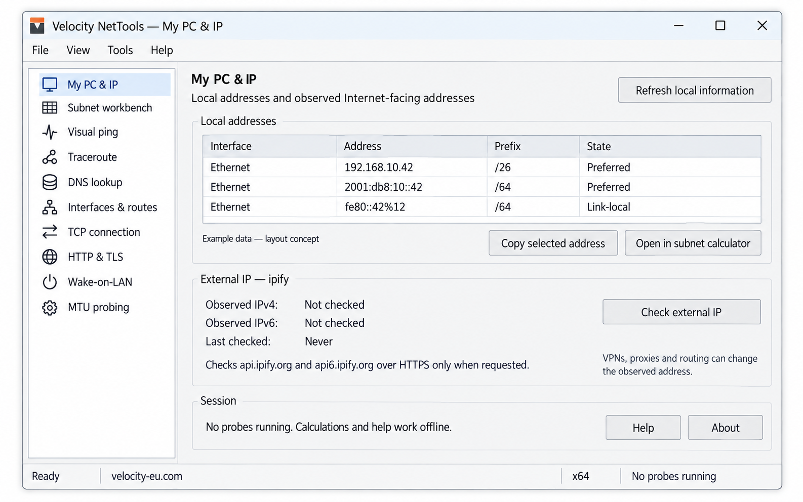
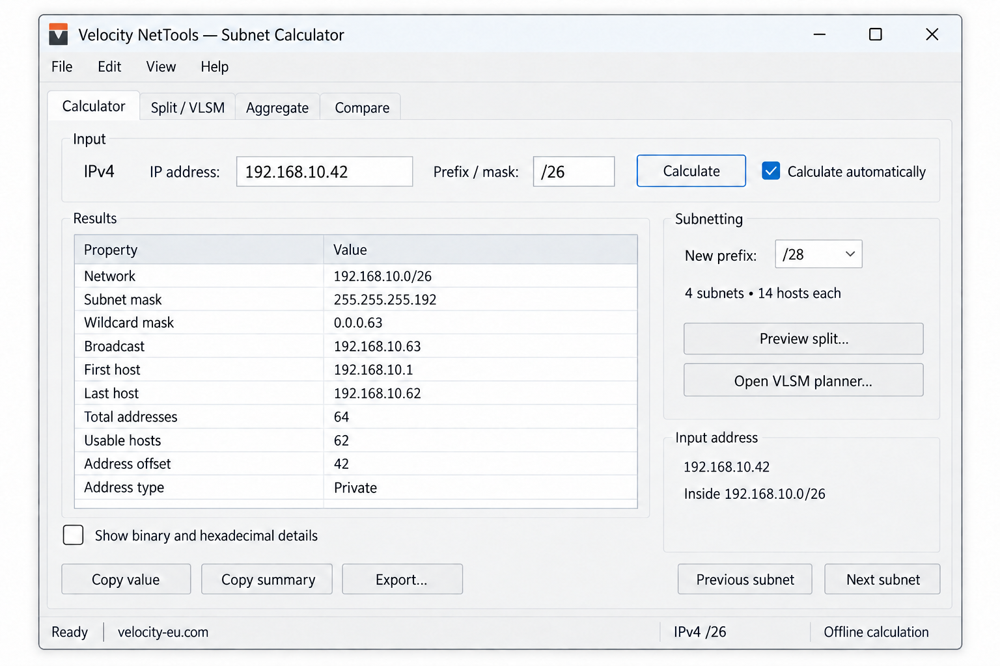

# Velocity NetTools — product design

Status: development approved on 12 September 2026; native preview implemented. See [validation status](../preview-status.md) for tested behavior and remaining gates.

## Confirmed requirements

- Brand: **Velocity NetTools**, by **Velocity EU Inc**; corporate site https://www.velocity-eu.com/.
- Use the original corporate wordmark and favicon from that site. Public author/publisher identity is **VEU**; authenticate publication through a GitHub App owned by velocityeu.
- Public repository: https://github.com/velocityeu/NetTools; MIT licence.
- Windows 10/11 and corresponding Windows Server families; x64 first.
- One portable executable with no separately installed application runtime or external manual.
- Stock native Windows controls; native GDI/Direct2D drawing for diagnostic charts.
- Complete searchable offline help, examples, online references and a professional About dialog.
- An engineering learning centre, with clear explanations and worked calculations.
- Include local PC addresses, external IP, and the originally proposed diagnostic tools.
- External IP provider: **ipify**, shown in the interface; lookup only on explicit user action.
- Design and review precede Windows application development.

## Architecture and compatibility

Use C++20, Unicode Win32, MSVC, Windows SDK and CMake. Compile Release with /MT consistently. Embed the manifest, icon, manual, notices and version resources. Calculation, saved-plan data, network jobs and native UI are separate components. Windows system DLLs are expected; application runtime sidecars, WebView2 and drivers are not.

Compatibility target: Windows 10 x64 build 10240 onward, Windows 11 x64 and Windows Server 2016 onward with Desktop Experience. Server Core is outside this GUI release. This is a target to verify on clean machines, not a tested claim. Only baseline APIs may be unconditional imports; optional later APIs require runtime resolution and fallbacks. Use PMv2 when supported and PMv1 on earlier systems, system fonts/colours, keyboard conventions and high contrast.

The [maths contract](math-contract.md), [Windows API contract](windows-api-contract.md), [network-tools contract](network-tools-contract.md) and [diagnostic maths](diagnostic-maths.md) define the detailed behaviour and acceptance checks. Each module must satisfy its contract before being offered as implemented.

## Full toolkit scope

| Tool | Included behaviour |
| --- | --- |
| My PC & IP | Enumerate local IPv4/IPv6 addresses, prefixes, interface names and status; show multiple active adapters and IPv6 scope. Explicit separate external IPv4/IPv6 checks through ipify, with source and timestamp. |
| Subnet workbench | Calculator, equal split/VLSM, exact aggregation/range conversion and directional comparison. Preserve all reviewed maths edge cases. |
| Visual ping | IPv4/IPv6, bounded multi-target sessions, latency chart, loss/error statistics, history, stop and export. |
| Traceroute | IPv4/IPv6 one-shot and repeated traces, per-probe replies/timeouts, hop changes, reverse lookup as an optional separate step, stop/export. |
| DNS | Standard engineer record lookups, system or explicit resolver, record details, cache/TTL explanation, distinct negative/timeout/error results and copy/export. |
| Interfaces, routes & neighbours | Read-only native snapshots with interface IDs, address families, metrics/state and refresh. Route choice is destination-specific. |
| TCP connection | Explicit host/IP and port connectivity, connection duration and specific error states; no claim of application health from a successful connect. |
| HTTP & TLS | Explicit URL inspection, response status/headers, redirect chain, certificate details and meaningful failure states, with response/redirect limits. |
| Wake-on-LAN | Validated MAC, explicit destination/interface/port, send outcome; explain that a sent packet does not prove a device woke up. |
| MTU probing | Bounded IPv4 DF and supported IPv6 probes with header accounting, discovered bounds and inconclusive outcomes. Never interpret silent filtering as proof of an MTU limit. |
| Help / About / files | Complete module help, F1, search, examples, glossary, corporate links, notices, explicit saved plans and exports. |

This expanded scope supersedes the earlier subnet-only first-release proposal. Implementation can proceed in tested increments and preview builds may contain a clearly identified subset. A release must not expose unimplemented tools as working controls. The full toolkit remains the agreed design target; there is no silent deferral of the requested diagnostics.

## Native shell and navigation

Use a normal resizable Win32 frame, standard menu and status bar, a native tool-navigation TreeView on the left and a tool pane on the right. The Subnet workbench retains its four internal tabs: Calculator, Split / VLSM, Aggregate and Compare. Other tools use native input controls, buttons and ListViews; charts are drawn with Windows APIs and have an equivalent readable data table.

Group tools as Addressing, Diagnostics, Network information and Utilities. Keep the active tool and any running jobs visible. Switching tools does not secretly start or stop a probe. A job indicator opens the relevant view; Stop targets that session, and Stop all cancels all sessions safely. Closing with active jobs stops scheduling and drains in-flight work according to the API contract without blocking the UI or destroying live callback state.

At narrow sizes, reflow or scroll the content within the available work area; never require a window larger than the monitor. Verify 100%, 150%, 200% and mixed-monitor DPI, keyboard-only operation, screen readers and high contrast. Tab order follows reading order and F1 targets the focused control.

## Address and diagnostic interactions

My PC & IP lists all relevant local addresses instead of selecting the first adapter and calling it “the PC IP”. Link-local, loopback, virtual/VPN and disconnected entries are labelled or filtered explicitly; scope identifiers remain attached to communication endpoints. Refreshing local information uses native APIs and performs no public IP lookup. Keep address scope/type distinct from the Windows address-assignment state in the table. Open in subnet calculator transfers the numeric address and reported prefix; for a scoped IPv6 endpoint it explicitly omits the interface zone from arithmetic, while preserving interface context in the source view. It never guesses a missing prefix.

Check external IP makes separate HTTPS requests for IPv4 and IPv6. Show “Observed external IPv4/IPv6”, the ipify host, observation time and independent success/error states. VPNs, proxies, NAT and routing may change the observed egress address. A failure reaching the lookup service is not a blanket claim that the Internet is disconnected. Do not use a cached observation as current without its timestamp.

Network tools start only through an explicit command, never at startup or merely when opening help. Read-only local inventory may load when its view opens. The subnet engine and offline manual work without network access. Standard operations should run as a normal user; permissions, filtering and unavailable APIs yield actionable errors, not automatic elevation or hidden system changes.

Target resolution is distinct from probe/connection timing. Preserve the resolved family/address used for each session; do not silently alternate destinations during a measurement. IPv6 scope and source-interface selection are available where needed. Proxy use is explicit in HTTP/external-IP results; raw ICMP/TCP probes are not implicitly equivalent to proxied HTTP.

All jobs have documented finite timeouts, concurrency, retained-history and export limits. Running work is cancellable from the user's perspective; cancellation stops new work and safely drains active operations. Show pending/cancelled/send-error outcomes separately from completed probe loss. Do not turn a missing RTT into zero or conclude that an intermediate router dropping ICMP necessarily drops transit traffic.

## Subnet workbench interactions

- Require a literal address and explicit prefix/mask. Pasted CIDR populates both. Infer family; never guess a prefix from historical classes. Reject ambiguous IPv4 forms and noncontiguous masks. Subnet arithmetic rejects zones/ports; diagnostic endpoint fields have their separate scoped-address parser.
- Preserve the entered host alongside the visibly normalised network. IPv4 shows mask, wildcard, bounds, counts and offset. IPv6 shows exact bounds/counts and no broadcast; address capacity is not an assignable-host count.
- Explain IPv4 /31 point-to-point, /32 host routes and IPv6 /127-/128. Special-purpose classification is separate from arithmetic; large ranges may have mixed classifications.
- Automatic calculation defaults on. Invalid/incomplete edits immediately make derived results unavailable and disable copying/exporting stale answers. Keep validation inline.
- Binary/hex details begin collapsed. Previous/next preserves host offset, moves one subnet and disables at either address-space boundary. For example, 192.168.10.42/26 moves to 192.168.10.106/26, in network .64/26.
- Use exact integer counts/endpoints, including 2^128. Never enumerate IPv6 hosts. Large splits use direct indexed paging and bounded exports.
- VLSM preserves pins and existing assignments, allocates deterministically around reservations, reports fragmentation and unallocated requirements, and requires explicit application of a partial proposal. A separate reallocation preview repacks movable rows.
- Exact aggregation introduces no new addresses. Covering supernets show additional coverage. Compare reports the intersection and both directional differences.
- Proposed maths limits and acceptance vectors are specified in math-contract.md and remain part of the design approval.

## Persistence and recovery

Application-owned settings/history are session-only by default. No app registry settings, services, automatic history files or silent self-update. Windows and Shell dialogs may maintain OS-owned state.

Save/Open plans are explicit, versioned UTF-8 JSON operations; CSV is a report, not a restorable plan. Network exports record target, timing, settings and outcome semantics. Saved sessions never resume network activity automatically.

Use a sibling temporary file and recovery backup according to the API contract. A failed replacement can change filenames: preserve recoverable prior bytes and report recovery paths. Keep dirty state until the outcome is established; saving an older snapshot does not mark newer edits clean. Escape JSON/CSV labels and protect spreadsheet-formula text.

Dirty plans prompt Save/Discard/Cancel on replacement or exit. Invalid/unsupported files leave the current plan intact. Read-only media still supports calculations and help; explicit saves request a writable location.

## Visual and publisher identity

Use the [official corporate wordmark](velocity-corporate-logo.png) unchanged on a dark background, and the [official corporate icon](velocity-corporate-favicon.png) for executable/favicon identity. Do not substitute the earlier provisional V drawing. Image-generated concepts are layout illustrations; the exact packaged artwork is authoritative.

The image illustrates the subnet pane's inputs/results. The expanded shell places it within the native tool navigation described above. It is not a screenshot of a running application.

Use system UI typography and colours in the app; use the website's blue, white and restrained corporate orange for editorial content. Chart series must be distinguishable without colour alone. Proposed tagline: **Clarity for every connection.**

## Delivery and remaining gates

The learning centre and GitHub manual share one source. The [Pages/release design](release-pipeline.md) provides automatic site updates, verified versioned downloads, preview/stable separation and immutable application releases. Website preparation exists locally; publication uses the installed [VEU-NetTools App](publishing-identity.md).

Starting development approves the expanded tool scope, native architecture, documented defaults and compatibility target. Signing credentials, clean-machine test infrastructure and secure App key provisioning remain prerequisites for their respective release steps. A design review cannot guarantee a bug-free executable; each module needs implementation tests and Windows validation before release.

See [Help and About](help-and-about.md), [final readiness review](final-readiness-review.md) and [search discovery](search-discovery.md).
