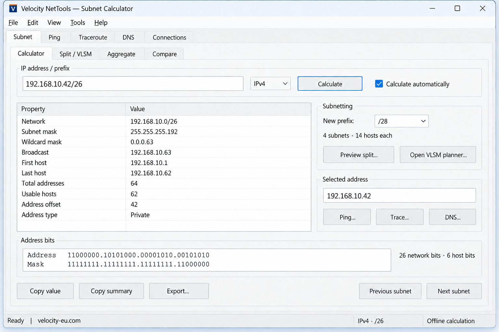

# Velocity NetTools — product design

Status: reviewed design submitted for development approval. No Windows application implementation is authorised until the user approves starting development.

## Confirmed

- Brand: **Velocity NetTools**. Publisher: **Velocity EU Inc**. Corporate link: https://www.velocity-eu.com/.
- Public repository: https://github.com/velocityeu/NetTools. MIT licence.
- Windows 10/11 and corresponding Windows Server families; x64 first release.
- One portable executable; no application runtime installation or external help files required.
- Stock native Windows controls. Native GDI/Direct2D drawing permitted for charts.
- Complete searchable help with examples and online resources, plus a professional About dialog.
- Companion webpage should be a training/help/refresher destination for engineers, explaining calculations simply and by hand.
- Design automatic releases from the outset; do not implement the application before final feature/UI approval.

## Recommended architecture

C++20, Win32 Unicode APIs, MSVC, Windows SDK and CMake. Use /MT for a statically linked C/C++ runtime; import APIs from system DLLs available on the chosen baseline. Embed manifest, icon, help and notices. Keep computation independent of UI and network probing. All network work must be asynchronous from the UI’s perspective, cancellable and bounded in memory/concurrency.

Compatibility target for approval: Windows 10 x64 from build 10240, Windows 11 x64, and Windows Server 2016 or later with Desktop Experience. Server Core is outside the GUI first-release scope. This is a target to verify on clean machines, not a claim of tested compatibility today. Use only baseline APIs as unconditional imports; dynamically detect newer optional APIs and provide fallbacks. Use per-monitor V2 DPI where available and per-monitor V1 on earlier Windows 10/Server versions. Handle scaling/layout changes explicitly. Native controls must follow system settings, keyboard conventions and high contrast. Avoid undocumented theme hacks. [Microsoft DPI guidance](https://learn.microsoft.com/en-us/windows/win32/hidpi/high-dpi-desktop-application-development-on-windows).

## Proposed first workbench

| View | Features |
| --- | --- |
| Calculator | IPv4/IPv6, prefix or mask, network bounds, exact counts, classification, binary/hex, copy/export |
| Split / VLSM | Equal splits, named host requirements, reservations, pinned allocations, free space, undo/redo |
| Aggregate | Exact prefix union and range-to-CIDRs; covering-supernet operation labelled separately |
| Compare | Equality, containment, overlap and extra coverage |

Subnet arithmetic must use exact integers, validate masks, preserve the entered host while displaying the normalised network, and handle /0 and full-width prefixes without overflow. IPv6 /0 address counts require a representation that can express 2^128. Do not enumerate IPv6 hosts. Explain /31, /32, /127 and /128 explicitly.

Potential subsequent tools: visual ping, repeated traceroute, DNS lookup, interface/routing/neighbor inspection, TCP connectivity, HTTP/TLS inspection, Wake-on-LAN and MTU probing.

## Interaction rules resolved during review

- First release contains the four subnet views above plus help, About and file operations. Diagnostic tabs and Ping/Trace/DNS actions shown in the concept image are future-layout illustrations: omit them from the first executable until implemented. The written scope takes precedence over the illustration.
- Calculator input has an address field and an explicit prefix/mask field. Pasting CIDR populates both. Address family is inferred; show it as a label, avoiding a contradictory IPv4/IPv6 selector. Missing prefix prompts for one; never guess from historical address classes. IPv4 dotted masks must be contiguous. Only literal addresses are accepted here; DNS is a separate later tool.
- Preserve the original host address alongside the normalised network. IPv4 results show mask, wildcard, range, counts and address offset. IPv6 shows prefix bounds and exact total addresses, with broadcast marked not applicable; do not label total IPv6 capacity as assignable host count. IPv6 allocation is by requested child prefix, not a misleading IPv4-style host-capacity rule.
- /31 IPv4 defaults to an explicitly labelled point-to-point interpretation; both addresses count as endpoints. /32 is one address/host route. Conventional subnet capacity never implies every special-purpose address is assignable. Explain mixed address classifications when a large block crosses special-purpose boundaries.
- Automatic calculation is on by default. Invalid or incomplete edits immediately mark results unavailable and disable copy/export/navigation of derived results. Show inline validation without repeated pop-ups. The Calculate command is useful in manual mode and explicit keyboard execution; it must not show stale results as current.
- Collapse binary/hex details initially. Reflow the action column below results on narrow windows. Use scrollable native content when the work area cannot fit the full layout; do not force a minimum window larger than the monitor work area. Verify 100%, 150% and 200% scaling, mixed-DPI moves and keyboard-only use. Tab order follows visible reading order; F1 targets the focused control.
- Previous/next subnet operates within the address width and disables at its boundaries; never wrap /0 or an end-of-address-space block back to zero.
- Split/VLSM uses native TreeView/ListView and paged or virtual results. Preview large operations before export; never enumerate hosts. IPv4 host requirements include router interfaces, then apply the selected conventional or point-to-point reservation rule. Allocate largest aligned blocks first around pinned allocations, preserving pins and reporting any unallocated requests without silently moving existing networks.
- Exact aggregation must not introduce addresses. Covering-supernet output includes an explicit extra-address count. Compare shows the actual intersection/difference, not just a yes/no verdict.
- Default state is session-only: no registry writes, automatic history files, services or self-update. Save/Open plan are explicit user actions using a versioned UTF-8 JSON format, and CSV export is a report rather than a restorable plan. Save As uses a sibling temporary file and replace-on-success to protect existing plans; failed saves leave the previous file intact. User labels must be escaped for JSON/CSV and spreadsheet-formula text handled safely in CSV.
- Dirty plans prompt Save/Discard/Cancel on replacement or closing. Opening malformed/unsupported plan versions leaves the current plan intact. Running from read-only media is supported; saves ask for a writable location without affecting calculation/help.
- Keep mathematical operations cancellable where they can be large. Cancellation must leave the last completed plan intact. Return focus to a sensible control after dialogs and navigation.

## Visual direction

This updated image uses the Velocity V mark, Velocity NetTools title and velocity-eu.com branding. It is a design illustration, not a screenshot of a built application. Preserve the standard Win32 controls and consider collapsing binary details by default.

Brand palette proposal:

| Token | Colour | Purpose |
| --- | --- | --- |
| Network blue | #0A3972 | Web headings, product identity, primary action |
| Signal cyan | #16A6D5 | Mathematical emphasis and graph series |
| Velocity orange | #EF5937 | Small corporate accent and instructional notes |
| Pale blue | #EDF4FA | Web learning surfaces |
| Ink | #182D44 | Web body text |

Typography: Segoe UI family for the website and OS-selected UI font for the application; monospace only where it helps compare addresses or bits. The approved V symbol uses a small orange accent and is paired with velocity-eu.com across the website, app concept, About dialog, favicon and repository identity. The actual corporate logo is not being replaced. Proposed tagline: **Clarity for every connection.** Brand name is confirmed; the icon, palette and tagline remain reviewable.

## Related designs

- [Help and About](help-and-about.md)
- [Release pipeline and download links](release-pipeline.md)
- [Engineer’s field guide](../help/README.md)

## Approval boundary and later operational choices

Starting development approves the scope and interaction defaults in this document: the full subnet workbench, IPv4/IPv6, session-only defaults with explicit saved plans, native offline help and the documented compatibility target. Graphical diagnostics follow in later releases.

Signing credentials and public website hosting are operational choices to resolve before the relevant publishing steps, and do not prevent application implementation. The default channel design is automatic prereleases from main and stable releases from version tags. A first release still requires passing compatibility and release checks; design approval is not evidence those checks have passed.
