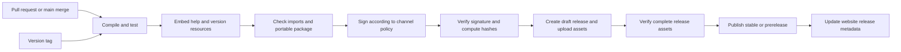

# Release pipeline and download design

Status: proposed architecture. No executable or application release workflows exist yet. The design must be implemented alongside the approved application build, not presented as a functioning pipeline now.

## Desired result

A bug fix or feature merge should produce a traceable, tested x64 preview automatically. A version tag should publish a stable release automatically after the release checks pass. The public learning centre should always lead to an authentic GitHub release, never to an invented or stale binary link.

## Channels and triggers

| Event | Validation | Output |
| --- | --- | --- |
| Pull request | Build, maths/property tests, lint/static checks, docs/example checks | CI artifacts for reviewers; no public release or signing access |
| Merge to main | Same gates, package verification, version metadata | A uniquely versioned GitHub prerelease for application changes |
| Stable tag vX.Y.Z | Validate tag, rebuild at exact tagged SHA, full release checks, signing policy | Stable GitHub release and release manifest |
| Preview tag vX.Y.Z-rc.N | Full release checks | Immutable release-candidate prerelease |
| Documentation-only change | Docs links/examples, website checks | Documentation update; no unnecessary executable release |

Use prerelease versions such as 0.2.0-dev.123+abcdef0; PE numeric version fields require a separate four-integer mapping. A stable version tag is the release intent, after which publishing can be automatic. Automatically making every merge a stable release is a separate policy decision; the proposed default protects the stable download while still publishing current builds.

## Build and publish stages

## Proposed implementation details

- CMake presets and an explicit Windows runner image label; record the runner image version, compiler and SDK with each build. Pin third-party actions to reviewed commit SHAs. Do not rely on mutable action tags or claim that a hosted runner image label is immutable.
- Use Release /MT. Embed the manual, common-controls manifest, icon, version information, MIT text and notices. Package one VelocityNetTools-x64.exe plus ancillary download files, not runtime sidecars.
- Treat maths edge cases as release gates: /0, /31, /32, /127, /128, alignment, invalid masks, exact aggregation, range coverage and overflow. Test lesson examples against the calculation engine once it exists.
- Inspect PE imports to enforce the supported API baseline and absence of separately installed runtime DLL dependencies. Run smoke/UI checks and a separate clean-machine compatibility matrix, including the oldest supported Windows image. Hosted runner success alone does not prove compatibility.
- Package once per publishing run and move those exact bytes into the release. Calculate checksums after signing. Archive commit SHA, version, tool versions, test results and documentation version. Publish build attestations when available; an attestation and Authenticode answer different questions.
- Code signing is a pending infrastructure decision. Use a supported signing service or protected certificate store with short-lived credentials if available. Do not place a private signing key in source control. Stable publishing must fail if a configured required signing step fails; never silently substitute an unsigned binary.
- Scope the default token to read-only. Give release-write permissions only to the trusted publishing job. Fork PR code cannot read signing credentials or publish. Avoid privileged execution of untrusted PR code.
- Create a draft release, upload the complete asset set and verify it before publishing. Failed checks publish nothing. Serialise publishing per version/channel and reject attempts to replace existing stable assets.
- If a workflow creates a tag or release using GITHUB_TOKEN, do not assume that event starts another workflow. Use an explicit reusable workflow/job or an appropriate supported dispatch for the website update. [GitHub trigger behaviour](https://docs.github.com/en/actions/how-tos/write-workflows/choose-when-workflows-run/trigger-a-workflow).
- Retry uploads idempotently against the same draft and commit. Include the run ID and source SHA in provenance so duplicate or stale runs cannot publish under a different version.

## Release assets

| Asset | Purpose |
| --- | --- |
| VelocityNetTools-x64.exe | The portable executable; stable filename on each release |
| SHA256SUMS.txt | Hash of each downloadable release artifact |
| release-manifest.json | Version, channel, commit, build date, OS minimum, filename and SHA-256 |
| CHANGELOG / release body | User-facing fixes, features, known issues and compatibility |
| Licence and notices | Convenient standalone copies; also embedded in the executable |

Do not add a ZIP unless users need it; the primary distribution remains one executable. GitHub’s automatic source archives are source code, not the app download.

## Learning centre → GitHub

Before the first release, show “No executable is available yet” and link to:

- https://github.com/velocityeu/NetTools/releases
- https://github.com/velocityeu/NetTools/tree/main/docs/help
- https://github.com/velocityeu/NetTools/issues

After the first stable release exists and its asset has been verified, the primary action becomes **Download for Windows x64**. It links to:

`https://github.com/velocityeu/NetTools/releases/latest/download/VelocityNetTools-x64.exe`

The adjacent **Release notes** link points to `/releases/latest`; **All versions** points to `/releases`. List prereleases separately and label them clearly. Use GitHub releases, not Actions artifact URLs that may expire or require sign-in. [GitHub release links](https://docs.github.com/en/repositories/releasing-projects-on-github/linking-to-releases).

For a version/size/checksum shown on the page, generate a static manifest from the published release. Bind that displayed metadata to an explicit versioned asset URL so there is no race where an old checksum accompanies a moving latest download. The generic “latest” action may remain separate. Deploy the page only after its referenced release is public. On metadata failure retain the previous valid release view; do not fall back to a prerelease or fictitious version.

Proposed site destinations: a corporate /nettools route or GitHub Pages. Hosting is not selected or activated by this design. The current webpage is a local preview with source in the public repository.

## Bugs, fixes and rollback

Issue → focused branch/PR → regression test and documentation update → merge → automatic prerelease → stable version tag → automatic stable publication.

Use semantic versions: patch for compatible fixes, minor for compatible features, major for breaking changes. Never overwrite a stable version with new bytes. For a bad release, document the issue, direct users to the last known-good version and publish a new patch. Do not silently rewrite tags or binaries. Keep historical manuals accessible.

The portable application does not silently update itself. Automatic publication means the release becomes downloadable; it does not install software on users’ machines.

## Decisions required before enabling publishing

1. Exact oldest Windows/Server versions and compatibility-test environment.
2. Signing provider and whether preview builds are also signed.
3. Acceptance of automatic prereleases from main and stable version-tag releases.
4. Public website hosting destination and manual versioning URL structure.

Security reference: [GitHub Actions secure use](https://docs.github.com/en/actions/reference/security/secure-use).
