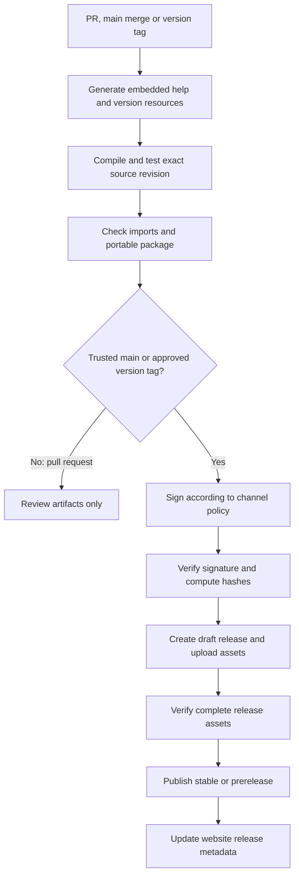

# Release pipeline and download design

Status: native build/release and Pages workflows are implemented. VEU-NetTools publishes previews under an explicit unsigned policy; stable publication is blocked pending signing and clean-machine tests. Release immutability is enabled.

## Desired result

A bug fix or feature merge should produce a traceable, tested x64 preview automatically. A version tag should publish a stable release automatically after the release checks pass. The public learning centre should always lead to an authentic GitHub release, never to an invented or stale binary link.

## Channels and triggers

| Event | Validation | Output |
| --- | --- | --- |
| Pull request | Build, maths/property tests, lint/static checks, docs/example checks | CI artifacts for reviewers; no public release or signing access |
| Merge to main | Same gates, package verification, version metadata | A uniquely versioned GitHub prerelease for application changes |
| Stable tag vX.Y.Z | Validate tag, rebuild at exact tagged SHA, full release checks, signing policy | Stable GitHub release and release manifest |
| Preview tag vX.Y.Z-rc.N | Full release checks | Immutable release-candidate prerelease |
| Web-only or repository-doc-only change | Docs links/examples, website checks | Documentation update; no unnecessary executable release |
| Embedded help, icon, licence or version-resource change | Full application gates | New application build, because executable content changed |

Use prerelease versions such as 0.2.0-dev.123+abcdef0; PE numeric version fields require a separate four-integer mapping. A stable version tag is the release intent, after which publishing can be automatic. Automatically making every merge a stable release is a separate policy decision; the proposed default protects the stable download while still publishing current builds.

## Build and publish stages

## Proposed implementation details

- CMake presets and an explicit Windows runner image label; record the runner image version, compiler and SDK with each build. Pin third-party actions to reviewed commit SHAs. Do not rely on mutable action tags or claim that a hosted runner image label is immutable.
- Generate/validate help, icons and version resources before compilation, then test and publish that resulting executable. A later signing step changes bytes but not the compiled source; verify its signature and compute the final hash after signing.
- The publish job condition explicitly excludes pull_request and fork contexts, regardless of successful tests. Stable tags must identify a reviewed main-history commit and pass the same checks at the tagged SHA. Validate semantic version and numeric PE-version fields; fail on any 16-bit field overflow rather than truncating build numbers.
- Use Release /MT. Embed the manual, common-controls manifest, icon, version information, MIT text and notices. Package one VelocityNetTools-x64.exe plus ancillary download files, not runtime sidecars.
- Treat maths edge cases as release gates: /0, /31, /32, /127, /128, alignment, invalid masks, exact aggregation, range coverage and overflow. Test lesson examples against the calculation engine once it exists.
- Inspect PE imports to enforce the supported API baseline and absence of separately installed runtime DLL dependencies. Run smoke/UI checks and a separate clean-machine compatibility matrix, including the oldest supported Windows image. Hosted runner success alone does not prove compatibility.
- Package once per publishing run and move those exact bytes into the release. Calculate checksums after signing. Archive commit SHA, version, tool versions, test results and documentation version. Attest final executable bytes in a trusted job with narrowly scoped id-token/attestations permissions; the separate publishing job alone needs contents write. An attestation and Authenticode answer different questions. [Artifact attestations](https://docs.github.com/en/actions/how-tos/secure-your-work/use-artifact-attestations/use-artifact-attestations).
- Proposed policy: stable releases require Authenticode signing, SHA-256 and a verified trusted timestamp with the expected publisher identity. Preview channels may be explicitly configured as unsigned before signing is provisioned and must say so in release notes. Every channel needs a declared policy: absent policy or any required signing/verification failure blocks publication. Never silently substitute an unsigned binary. The signing provider remains a pending infrastructure decision; keep keys outside source control. [SignTool](https://learn.microsoft.com/en-us/windows/win32/seccrypto/signtool).
- Scope the default token to read-only. Give release-write permissions only to the trusted publishing job. Fork PR code cannot read signing credentials or publish. Avoid privileged execution of untrusted PR code.
- Enable GitHub release immutability before the first application release; the setting applies prospectively. Create a draft, upload and verify the complete asset set, then publish. Failed checks publish nothing. Never change published binary bytes or reuse a version/tag in any channel. [Immutable releases](https://docs.github.com/en/code-security/concepts/supply-chain-security/immutable-releases).
- Under a shared publication lock, compare the candidate semantic version and channel revision with the current channel head before promoting latest or deploying download metadata. A slower old run must not move downloads backwards; historical releases remain available without promotion. Set make_latest explicitly, since GitHub defaults it to true. Actions concurrency alone does not establish version order. A rollback is a separately recorded action. [Release API](https://docs.github.com/en/rest/releases/releases), [concurrency](https://docs.github.com/en/actions/how-tos/write-workflows/choose-when-workflows-run/control-workflow-concurrency).
- If a workflow creates a tag or release using GITHUB_TOKEN, do not assume that event starts another workflow. Use an explicit reusable workflow/job or an appropriate supported dispatch for the website update. [GitHub trigger behaviour](https://docs.github.com/en/actions/how-tos/write-workflows/choose-when-workflows-run/trigger-a-workflow).
- Retry uploads idempotently against the same draft using the retained final signed bytes and their digests. Rebuilding the same commit is not proof of identical bytes. Include run ID and source SHA in provenance so duplicate or stale runs cannot publish under a different version.

## Release assets

| Asset | Purpose |
| --- | --- |
| VelocityNetTools-x64.exe | The portable executable; stable filename on each release |
| SHA256SUMS.txt | SHA-256 of the executable, manifest and other uploaded ancillary assets; excludes itself and GitHub-generated source archives |
| release-manifest.json | Version, channel, commit, build date, OS minimum, filename and SHA-256 |
| CHANGELOG / release body | User-facing fixes, features, known issues and compatibility |
| Licence and notices | Convenient standalone copies; also embedded in the executable |

Generate in order: final signed EXE → its SHA-256 → release manifest → ancillary assets → SHA256SUMS.txt. Do not create a checksum self-reference. Verify the actual uploaded/downloaded bytes against this set before publication.

Do not add a ZIP unless users need it; the primary distribution remains one executable. GitHub’s automatic source archives are source code, not the app download.

## Learning centre → GitHub

Before the first release, show “No executable is available yet” and link to:

- https://github.com/velocityeu/NetTools/releases
- https://github.com/velocityeu/NetTools/tree/main/docs/help
- https://github.com/velocityeu/NetTools/issues

When only prereleases exist, show **Preview available; no stable release yet**, with an explicit versioned preview EXE link and release notes. GitHub's latest endpoint excludes prereleases; it cannot serve this state. Once stable exists, keep preview downloads separate.

After the first stable release exists and its asset has been verified, the primary action becomes **Download for Windows x64**. It links to:

`https://github.com/velocityeu/NetTools/releases/latest/download/VelocityNetTools-x64.exe`

The adjacent **Release notes** link points to `/releases/latest`; **All versions** points to `/releases`. List prereleases separately and label them clearly. Use GitHub releases, not Actions artifact URLs that may expire or require sign-in. [GitHub release links](https://docs.github.com/en/repositories/releasing-projects-on-github/linking-to-releases).

For a version/size/checksum shown on the page, generate a static manifest from the published release. Bind that displayed metadata to an explicit versioned asset URL so there is no race where an old checksum accompanies a moving latest download. The generic “latest” action may remain separate. Deploy the page only after its referenced release is public. On metadata failure retain the previous valid release view; do not fall back to a prerelease or fictitious version.

## GitHub Pages implementation

Selected hosting: **https://velocityeu.github.io/NetTools/**. Corporate identity and links remain velocity-eu.com; a custom domain can be added later without changing the release source.

The [Pages workflow](../../.github/workflows/pages.yml) checks generated help, prepares the static website and deploys with the official GitHub Pages actions. Relevant main-branch website/help changes, manual dispatch and published-release events refresh the page. It does not build the Windows application. Only website artifacts are uploaded to Pages.

Configure the github-pages environment with selected deployment rules for the main branch and version tags matching v[0-9]*.[0-9]*.[0-9]*. GitHub evaluates the triggering ref, so a release-triggered run retains its tag ref even when the workflow checks out main. A main-only rule rejects the deploy job after a successful site build. Both rules are provisioned; keep this configuration when recreating the environment. [GitHub environment deployment rules](https://docs.github.com/en/actions/how-tos/deploy/configure-and-manage-deployments/manage-environments).

The [site preparation script](../../scripts/prepare_site.py) reads public GitHub release metadata and verifies downloadable executable bytes before generating versioned download links. No-release, preview-only and stable-with-optional-preview states are explicit. Missing/invalid release data fails the build so the last successful website stays deployed; a verified empty release list shows the truthful design state. The live browser does not depend on GitHub API calls.

The selected publisher is a velocityeu-owned GitHub App, with installation-token publication attributed to the organisation App. Its published release events can trigger Pages directly. If a future publication step instead uses GITHUB_TOKEN, it must explicitly dispatch this Pages workflow after verified publication, or call the same website build/deploy jobs. Merely creating a release with GITHUB_TOKEN does not trigger another workflow. Grant actions write only to that trusted dispatch step if chosen; do not give it to build or PR jobs. Automated website refresh then needs no manual edit of the download button.

Public publishing identities must follow [the VEU identity contract](publishing-identity.md); never use personal credentials as a fallback. The App registration, restricted installation and encrypted Actions key are provisioned.

## Bugs, fixes and rollback

Issue → focused branch/PR → regression test and documentation update → merge → automatic prerelease → stable version tag → automatic stable publication.

Use semantic versions: patch for compatible fixes, minor for compatible features, major for breaking changes. Never overwrite a stable version with new bytes. For a bad release, document the issue, direct users to the last known-good version and publish a new patch. Do not silently rewrite tags or binaries. Keep historical manuals accessible.

The portable application does not silently update itself. Automatic publication means the release becomes downloadable; it does not install software on users’ machines.

## Decisions required before enabling publishing

1. Provision clean-machine tests for the compatibility target in product-design.md, including Windows 10 build 10240 and Server 2016 Desktop Experience. GitHub-hosted runners do not provide this full historical/GUI matrix; use separately managed clean VMs with interactive sessions and documented evidence.
2. Signing provider and explicit channel signing policies; enable immutable releases before first publication.
3. Acceptance of automatic prereleases from main and stable version-tag releases.
4. Implement historical manual versions tied to released executable versions; GitHub Pages hosting itself is already selected.

Security reference: [GitHub Actions secure use](https://docs.github.com/en/actions/reference/security/secure-use).
